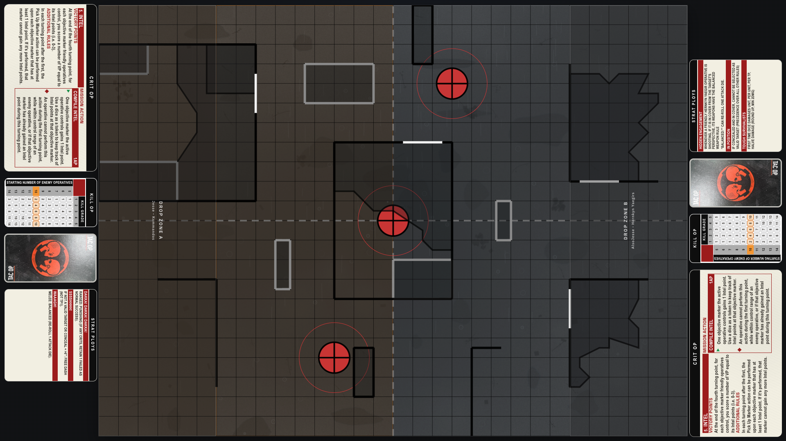
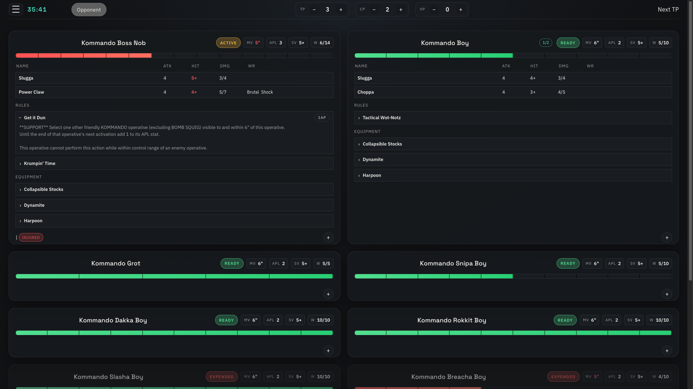
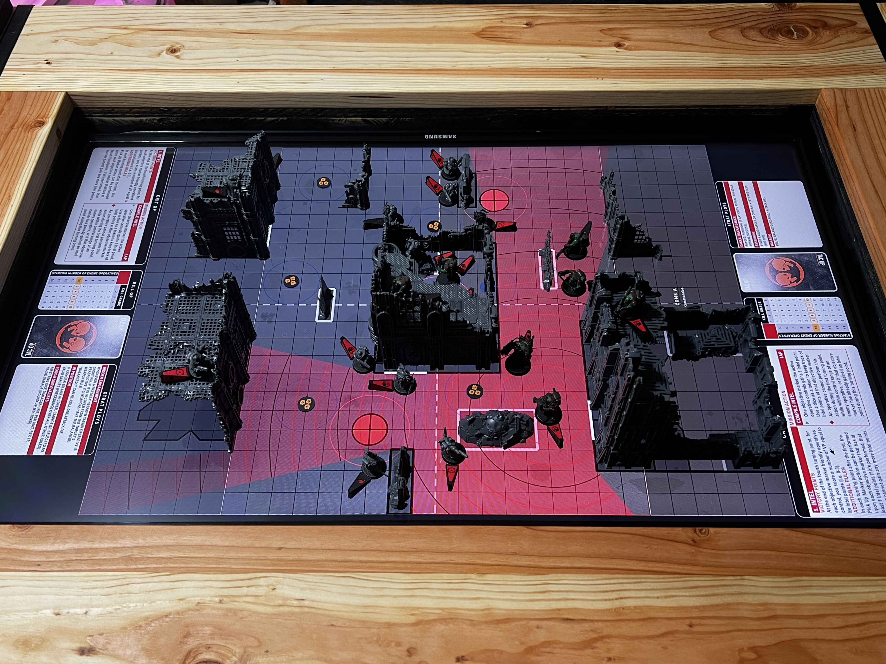
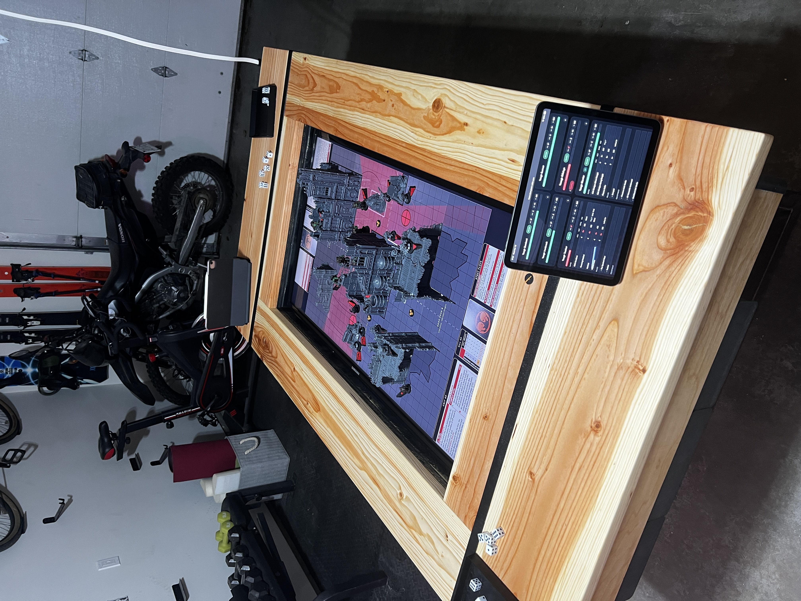

# Kill Team Speedrun Cards

Live site: https://ktspeedrun.jesse-miller.com/

Demo note: full multiplayer flow is best tested with 3 browser sessions (2 players plus 1 map view).

A full-stack React app for running fast, structured Kill Team match setup and tracking. The project combines a guided pre-game workflow, in-game board support, and multiplayer room sync over WebSockets.

## Project story

This started as a practical weekend tool so my friends and I could get into games faster. The first goal was simple: reduce setup friction and keep key game info in one place.

As we used it in real matches, new needs kept appearing (lobby sync, board helpers, persistent selections, and smoother flow between setup steps). What began as a quick utility turned into a real software project with iterative feature growth, testing, and architecture decisions driven by actual use.

## Screenshots

### Board setup view



### Player screen



### Live side view



### Board and player screen (live)



## Why this project

Kill Team setup often involves bouncing between rule references, handwritten notes, and memory. This app turns that into a guided, step-by-step flow that helps players learn the sequence, remember what matters at each phase, and see relevant rules when they are actually needed.

By organizing core data (teams, equipment, ops choices, board context, and state) in one place, it reduces rulebook lookup time and cuts down table debate over what happens next. The practical outcome is faster games that follow the rules more accurately, with less interruption and more time spent actually playing.

## Development approach: speed with discipline

I intentionally used AI-assisted development to move quickly on repetitive and exploratory tasks, while keeping engineering standards high.

- Used AI to accelerate drafting, refactors, and test scaffolding.
- Verified behavior manually in-browser and with automated tests.
- Kept features modular across pages, components, and shared state.
- Preserved maintainability with linting, unit tests, and end-to-end tests.
- Treated AI output as a starting point, then reviewed and adjusted for correctness and product fit.

The result is a project that was built fast enough to be useful early, but structured well enough to keep growing.

## Core features

- Multi-step match flow with routing from lobby to end-of-game results.
- Team and operative selection, equipment loadouts, Tac Ops, and Primary Op choices.
- Shared multiplayer lobby with room codes and ready-state flow.
- Dedicated map participant mode for board-side controls.
- Local persistence for key selections and multiplayer identity.
- Test coverage across unit tests and Playwright end-to-end scenarios.

## Tech stack

- Frontend: React 19, React Router 7, Vite
- Realtime: Native WebSocket API + Node.js ws server
- State/persistence: React context + browser storage
- Optional distributed room state: Redis
- Quality: Vitest, Testing Library, Playwright, ESLint

## Project structure

- `src/pages`: Feature pages for setup, gameplay flow, and results.
- `src/components`: Reusable UI blocks (cards, board views, panels).
- `src/state`: Shared app state, persistence, and multiplayer client utilities.
- `src/data`: Static game data sources.
- `server`: WebSocket room server and multiplayer room utilities.
- `tests/e2e`: Playwright browser tests.

## Local development

### Prerequisites

- Node.js 20+
- npm 10+

### Install dependencies

```bash
npm install
```

### Start frontend and WebSocket server together

```bash
npm run dev:all
```

This runs:

- Vite frontend dev server
- Node WebSocket server with watch mode

### Run frontend only

```bash
npm run dev
```

### Run WebSocket server only

```bash
npm run dev:server
```

## Environment variables

Client-side:

- `VITE_WS_URL`: Explicit websocket URL for the frontend (example: `wss://your-domain.com`).

Server-side:

- `PORT`: WebSocket server port (default `8080`).
- `DEBUG_WS=1`: Enables websocket debug logging.
- `INSTANCE_ID`: Optional stable instance identifier for logs.
- `REDIS_URL`: Enables shared room state across instances.
- `REDIS_TTL_SECONDS`: Room snapshot TTL (default `21600`).

## Testing

```bash
npm run test:unit
npm run test:e2e
```

Additional checks:

```bash
npm run lint
npm run build
```

## Deployment notes

- Frontend can be deployed as a static Vite build.
- Current `vercel.json` rewrite supports SPA routes.
- In production, set `VITE_WS_URL` so clients connect to your deployed websocket host.
- For multi-instance websocket deployments, configure `REDIS_URL` to avoid process-local room desync.

## Engineering highlights

- Implemented full client/server realtime room flow with graceful reconnect handling and role-based lobby behavior.
- Added durable user/session state for smoother multi-page workflows.
- Built and maintained both component-level and end-to-end test coverage.
- Organized domain data and UI into modular folders for maintainability and future feature growth.

## Data attribution

Some data in this repository was adapted from community-maintained JSON sources on GitHub.

- `src/data/kt24_v4.json` source: https://github.com/vjosset/killteamjson
- `src/data/weaponRules.json` source: https://github.com/vjosset/ktdash-v4-public

Each source remains the property of its respective authors. Please review and follow the original license/usage terms for redistributed data.

## Roadmap

- Expand supported content: more armies, rules, equipment, maps, and mission sets.
- Improve accessibility audit coverage (keyboard and ARIA refinements).
- Add CI workflow for lint, unit tests, and e2e smoke tests.

## License

Project source code is licensed under the MIT License. See `LICENSE`.

Third-party data files are attributed in `THIRD_PARTY_NOTICES.md` and remain subject to their original source terms.
